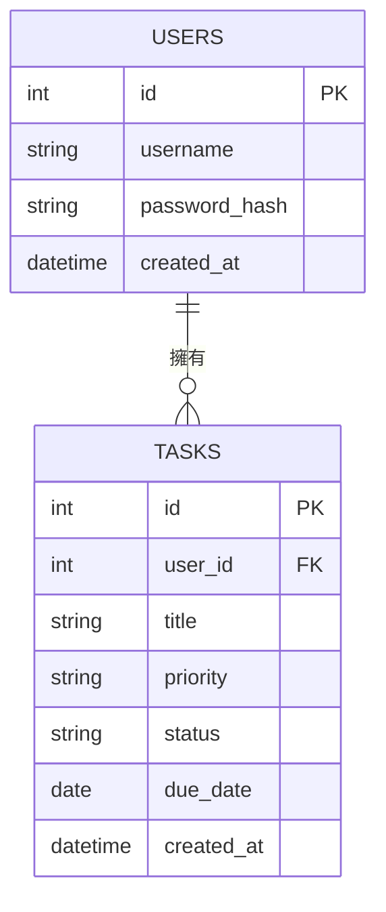

# 資料庫設計 (DB Design)

## 1. ER 圖（實體關係圖）

## 2. 資料表詳細說明

### `users` (使用者資料表)
儲存系統使用者的帳號密碼資訊。
- `id` (INTEGER): 主鍵，自動遞增。
- `username` (TEXT): 帳號名稱，不可重複 (UNIQUE)，必填。
- `password_hash` (TEXT): 經過雜湊處理的密碼，必填。
- `created_at` (DATETIME): 帳號建立時間，預設為當下時間。

### `tasks` (任務資料表)
儲存待辦事項的內容與狀態。
- `id` (INTEGER): 主鍵，自動遞增。
- `user_id` (INTEGER): 外部鍵，對應 `users` 表的 `id`，代表該任務屬於哪位使用者，必填。
- `title` (TEXT): 任務標題/內容，必填。
- `priority` (TEXT): 優先級（例如：'High', 'Medium', 'Low'），預設 'Medium'。
- `status` (TEXT): 任務狀態（例如：'Pending', 'Completed'），預設 'Pending'。
- `due_date` (DATE): 截止日期，選填。
- `created_at` (DATETIME): 任務建立時間，預設為當下時間。

## 3. SQL 建表語法
建表語法已儲存於 `database/schema.sql`。

## 4. Python Model 程式碼
本專案採用 Python 內建的 `sqlite3`，Model 放置於 `app/models/`，包含基礎的 CRUD 操作。
