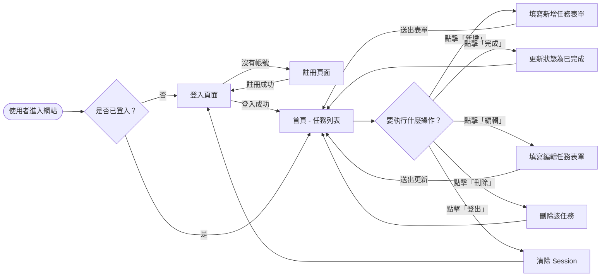
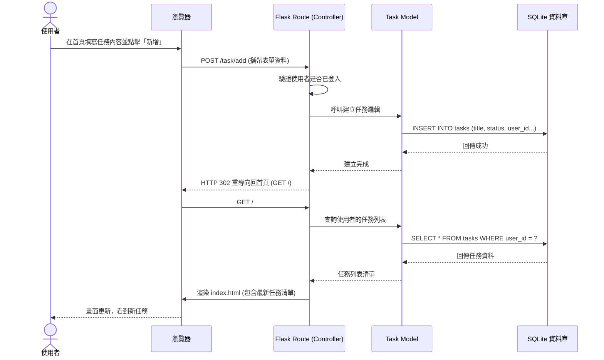

# 流程圖設計 (Flowchart)

根據 PRD 與系統架構，以下是本任務管理系統的流程與操作路徑設計。

## 1. 使用者流程圖 (User Flow)

這張流程圖展示了使用者進入網站後，可能進行的所有主要操作路徑。

## 2. 系統序列圖 (Sequence Diagram)

以「使用者新增一個任務」為例，展示後端各元件如何協作。

## 3. 功能清單與路由對照表

規劃後端應該提供的 URL 節點與 HTTP 方法對應：

| 功能名稱 | URL 路徑 | HTTP 方法 | 說明 |
| -------- | -------- | --------- | ---- |
| 首頁與任務列表 | `/` | `GET` | 渲染首頁，並顯示登入使用者的任務列表 |
| 使用者註冊 | `/auth/register` | `GET`, `POST` | 渲染註冊表單 (`GET`) 與處理註冊邏輯 (`POST`) |
| 使用者登入 | `/auth/login` | `GET`, `POST` | 渲染登入表單 (`GET`) 與處理登入邏輯 (`POST`) |
| 使用者登出 | `/auth/logout` | `GET` | 清除使用者 Session，跳回登入頁面 |
| 新增任務 | `/task/add` | `POST` | 接收表單資料，建立新任務，並重導向回首頁 |
| 編輯任務 | `/task/edit/<id>` | `POST` | 更新特定 ID 的任務內容，並重導向回首頁 |
| 更新任務狀態 | `/task/status/<id>` | `POST` | 將任務切換為已完成/未完成，並重導向回首頁 |
| 刪除任務 | `/task/delete/<id>` | `POST` | 刪除特定 ID 的任務，並重導向回首頁 |
